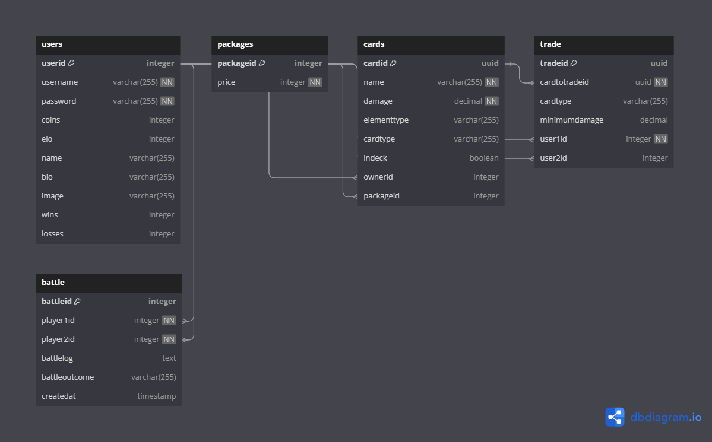

# Protocol
## Design

**Project Structure:**
The project was structured around a Java-based server application without the use of additional frameworks for HTTP communication, adhering to the project requirements. The application was divided into several layers, including controllers, services, repositories, and entities.

**Database Integration:** A PostgreSQL database was used for data persistence. Repositories were implemented for interaction with the database, handling required operations for users, cards, trades, and battles.

## Lessons Learned
**Complex Logic Breakdown:** Handling complex game mechanics taught the importance of breaking down intricate logic into smaller, manageable functions. This approach not only simplifies the implementation but also makes the code more readable and easier to debug.

**Unit Testing and Mocking:** Writing unit tests for complex components, particularly those interacting with the database, was challenging. Using mocking frameworks like Mockito to simulate database interactions and isolate components for testing was a crucial learning point. It underscores the importance of test-driven development and the need to write testable code.

**Code Organization and Structure:** Maintaining a clean and organized codebase with well-defined layers (controllers, services, repositories, entities) was vital for the maintainability and scalability of the project.

## Unit Testing Decisions
**Testing Strategy**
I started by testing entities, then moved to more complex components, ensuring that the fundamental building blocks and critical functionalities were reliable and effective.

**Entity Testing:**
Testing entities as they are fundamental to the application and typically have less complex logic.

**Repository Testing:** 
Tests for the Card Repository, one of the more complex parts of my application, due to its critical database interactions.

**Service Layer Testing:**
Tests for Trade Service, as it contains core business logic and interacts with multiple repositories, making it a crucial integration point in my application.

**Controller Testing:** 
Tests for Battle and User Controllers to ensure they correctly manage HTTP requests and responses, acting as reliable interfaces between server and clients.

**Curl Request Testing:**
To simulate real-world interactions, I tested actual curl requests. This approach helped assess the app's behavior in real-world scenarios.

## Unique Feature
**Password Hashing with bcrypt:**
I've implemented bcrypt for password hashing as a unique feature to enhance user security. This ensures that user passwords are never stored in plain text, as bcrypt hashes the passwords during registration and login. It's a robust defense against common security threats like brute-force attacks.

## Time spent

- Started working on Project: 03.01.2024
- Project finished on: 17.01.2024
- Active days: 11
- Time spent daily: 4-6 hours
- **Total Tiem Spent: ~55 hours**

## Link to Git
https://github.com/UmairSa/SWEN1.git
